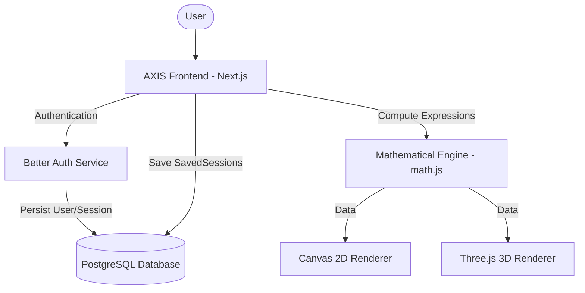

# AXIS Graphing Calculator

AXIS is a professional, high-performance mathematical suite designed for precision visualization and symbolic computation. Built with modern web technologies, it provides a seamless experience for students, engineers, and researchers to explore mathematical concepts in 2D and 3D.

[](https://opensource.org/licenses/MIT)
[](https://github.com/lwshakib/axis-graphing-calculator)

## 🚀 Key Features

- **2D Graphing Workspace**: Interactive coordinate plane with adaptive sampling for high-fidelity rendering of trigonometric, logarithmic, and polynomial functions.
- **3D Surface Mapping**: Visualize multivariate calculus and vector fields in a responsive Three.js environment with dynamic lighting and orbit controls.
- **Scientific Studio**: Natural mathematical input powered by MathLive, supporting symbolic simplification, numerical integration, and matrix operations.
- **Session Management**: Secure user accounts with social login (Google) and email/password. Automatically sync and manage your mathematical research across devices.
- **Tactile UI**: A premium, "designed for mastery" aesthetic featuring zero-radius inputs, glassmorphic elements, and smooth animations.

## 🛠 Technology Stack

- **Frontend**: [Next.js 15](https://nextjs.org/) (App Router), [React 19](https://react.dev/), [Tailwind CSS](https://tailwindcss.com/)
- **Visuals**: [Three.js](https://threejs.org/) (3D), HTML5 Canvas (2D), [Framer Motion](https://www.framer.com/motion/) (Animations)
- **Math Engine**: [math.js](https://mathjs.org/), [MathLive](https://cortexjs.io/mathlive/)
- **Backend & Auth**: [Prisma](https://www.prisma.io/), [Better Auth](https://better-auth.com/), [PostgreSQL](https://www.postgresql.org/)

## 🏗 System Architecture



## 🚥 Getting Started

### Prerequisites

- Node.js 18+ or Bun 1.1+
- PostgreSQL database instance

### Installation

1. Clone the repository:
   ```bash
   git clone https://github.com/lwshakib/axis-graphing-calculator.git
   cd axis-graphing-calculator
   ```

2. Install dependencies:
   ```bash
   bun install
   # or
   npm install
   ```

3. Setup environment variables:
   ```bash
   cp .env.example .env
   # Update .env with your database and OAuth credentials
   ```

4. Initialize the database:
   ```bash
   bun x prisma db push
   ```

5. Run the development server:
   ```bash
   bun dev
   # or
   npm run dev
   ```

6. Open [http://localhost:3000](http://localhost:3000) to launch AXIS.

## 🤝 Contributing

Contributions make the open-source community an amazing place to learn, inspire, and create. Any contributions you make are **greatly appreciated**.

Please see [CONTRIBUTING.md](CONTRIBUTING.md) for our detailed development workflow and coding standards.

## 📜 License

Distributed under the MIT License. See `LICENSE` for more information.

## ✉️ Contact

**lwshakib** - [GitHub](https://github.com/lwshakib) - [@lwshakib](https://twitter.com/lwshakib)

Project Link: [https://github.com/lwshakib/axis-graphing-calculator](https://github.com/lwshakib/axis-graphing-calculator)
